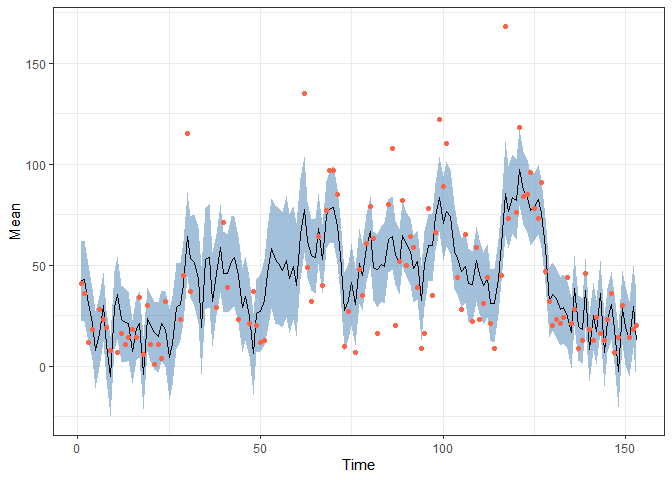
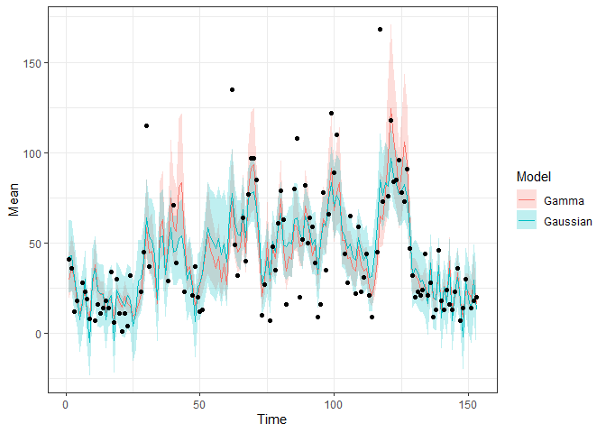
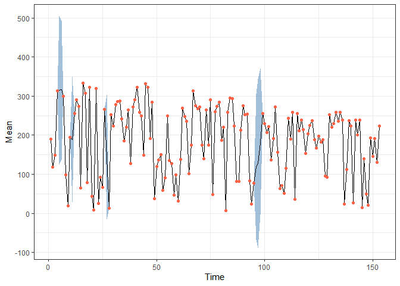
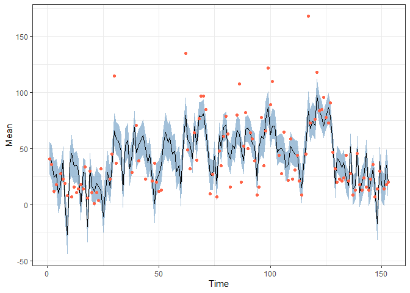

<!-- README.md is generated from README.Rmd. Please edit that file -->

# bssm

<!-- badges: start -->

[](https://www.repostatus.org/#active)
[](https://github.com/helske/bssm/actions)
[](https://codecov.io/gh/helske/bssm?branch=master)
[](http://cran.r-project.org/package=bssm)
[](http://cranlogs.r-pkg.org/badges/bssm)

<!-- badges: end -->

The `bssm` R package provides efficient methods for Bayesian inference
of state space models via particle Markov chain Monte Carlo and
importance sampling type weighted MCMC. Currently Gaussian, Poisson,
binomial, negative binomial, and Gamma observation densities with
linear-Gaussian state dynamics, as well as general non-linear Gaussian
models and discretely observed latent diffusion processes are supported.

For details, see

-   [The bssm paper on ArXiv](https://arxiv.org/abs/2101.08492) (to
    appear in R Journal),
-   [Package vignettes at
    CRAN](https://cran.r-project.org/web/packages/bssm/index.html)
-   Paper on [Importance sampling type estimators based on approximate
    marginal Markov chain Monte
    Carlo](https://onlinelibrary.wiley.com/doi/abs/10.1111/sjos.12492)

There are also couple posters and a talk related to IS-correction
methodology and bssm package:

-   [UseR!2021 talk
    slides](https://jounihelske.netlify.app/talk/user2021/)  
-   [SMC 2017 workshop: Accelerating MCMC with an
    approximation](http://users.jyu.fi/~jovetale/posters/SMC2017)
-   [UseR!2017: Bayesian non-Gaussian state space models in
    R](http://users.jyu.fi/~jovetale/posters/user2017.pdf)

The `bssm` package was originally developed with the support of Academy
of Finland grants 284513, 312605, and 311877. Current development is
focused on increased usability. For recent changes, see NEWS file.

### Citing the package

If you use the `bssm` package in publications, please cite the
corresponding R Journal paper:

Jouni Helske and Matti Vihola (2021). “bssm: Bayesian Inference of
Non-linear and Non-Gaussian State Space Models in R.” *R Journal*. To
appear. ArXiv preprint <https://arxiv.org/abs/2101.08492>.

## Installation

You can install the released version of bssm from
[CRAN](https://CRAN.R-project.org) with:

``` r
install.packages("bssm")
```

And the development version from [GitHub](https://github.com/) with:

``` r
# install.packages("devtools")
devtools::install_github("helske/bssm")
```

Or from R-universe with

``` r
install.packages("bssm", repos = "https://helske.r-universe.dev")
```

## Example

Consider the daily air quality measurements in New Your from May to
September 1973, available in the `datasets` package. Let’s try to
predict the missing ozone levels by simple linear-Gaussian local linear
trend model with temperature and wind as explanatory variables (missing
response variables are handled naturally in the state space modelling
framework, however no missing values in covariates are normally
allowed);

``` r
library("bssm")
#> 
#> Attaching package: 'bssm'
#> The following object is masked from 'package:base':
#> 
#>     gamma
library("dplyr")
#> 
#> Attaching package: 'dplyr'
#> The following objects are masked from 'package:stats':
#> 
#>     filter, lag
#> The following objects are masked from 'package:base':
#> 
#>     intersect, setdiff, setequal, union
library("ggplot2")
set.seed(1)

data("airquality", package = "datasets")

# Covariates as matrix. For complex cases, check out as_bssm function
xreg <- airquality %>% select(Wind, Temp) %>% as.matrix()

model <- bsm_lg(airquality$Ozone,
  xreg = xreg,  
  # Define priors for hyperparameters (i.e. not the states), see ?bssm_prior
  # Initial value followed by parameters of the prior distribution
  beta = normal_prior(rep(0, ncol(xreg)), 0, 1),
  sd_y = gamma_prior(1, 2, 0.01),
  sd_level = gamma_prior(1, 2, 0.01), 
  sd_slope = gamma_prior(1, 2, 0.01))

fit <- run_mcmc(model, iter = 20000, burnin = 5000)
fit
#> 
#> Call:
#> run_mcmc.lineargaussian(model = model, iter = 20000, burnin = 5000)
#> 
#> Iterations = 5001:20000
#> Thinning interval = 1
#> Length of the final jump chain = 3593
#> 
#> Acceptance rate after the burn-in period:  0.239
#> 
#> Summary for theta:
#> 
#>  variable       Mean          SE        SD        2.5%     97.5% ESS
#>  sd_level  6.3731836 0.113153715 2.8013937  1.52958636 12.403961 613
#>  sd_slope  0.3388712 0.010355574 0.2833955  0.04210885  1.070284 749
#>      sd_y 20.8618647 0.068145131 1.9369381 17.08728231 24.722309 808
#>      Temp  1.0265846 0.007497538 0.2064343  0.60226671  1.400436 758
#>      Wind -2.5183269 0.020978488 0.5764833 -3.68987992 -1.327578 755
#> 
#> Summary for alpha_154:
#> 
#>  variable time        Mean         SE        SD       2.5%     97.5%  ESS
#>     level  154 -28.3163054 0.69650977 20.132341 -69.271049 11.797133  835
#>     slope  154  -0.3740463 0.03683278  1.685733  -4.065499  2.830134 2094
#> 
#> Run time:
#>    user  system elapsed 
#>    0.87    0.00    0.88

obs <- data.frame(Time = 1:nrow(airquality),
  Ozone = airquality$Ozone) %>% filter(!is.na(Ozone))

pred <- fitted(fit, model)
pred %>%
  ggplot(aes(x = Time, y = Mean)) + 
  geom_ribbon(aes(ymin = `2.5%`, ymax = `97.5%`), 
    alpha = 0.5, fill = "steelblue") + 
  geom_line() + 
  geom_point(data = obs, 
    aes(x = Time, y = Ozone), colour = "Tomato") +
  theme_bw()
```



Same model but now assuming observations are from Gamma distribution:

``` r
model2 <- bsm_ng(airquality$Ozone,
  xreg = xreg,  
  beta = normal(rep(0, ncol(xreg)), 0, 1),
  distribution = "gamma",
  phi = gamma_prior(1, 2, 0.01),
  sd_level = gamma_prior(1, 2, 0.1), 
  sd_slope = gamma_prior(1, 2, 0.1))

fit2 <- run_mcmc(model2, iter = 20000, burnin = 5000, particles = 10)
fit2
#> 
#> Call:
#> run_mcmc.nongaussian(model = model2, iter = 20000, particles = 10, 
#>     burnin = 5000)
#> 
#> Iterations = 5001:20000
#> Thinning interval = 1
#> Length of the final jump chain = 3858
#> 
#> Acceptance rate after the burn-in period:  0.257
#> 
#> Summary for theta:
#> 
#>  variable         Mean           SE          SD          2.5%       97.5%  ESS
#>       phi  4.006977632 0.0159088062 0.536273508  3.0263444882  5.15527365 1136
#>  sd_level  0.057158663 0.0020138200 0.035366227  0.0083794202  0.14651419  308
#>  sd_slope  0.003894013 0.0001752319 0.003654978  0.0004250207  0.01374575  435
#>      Temp  0.052808820 0.0002404538 0.008701489  0.0353736458  0.06992423 1310
#>      Wind -0.057351094 0.0004338213 0.015411504 -0.0873384757 -0.02700112 1262
#>         SE_IS ESS_IS
#>  4.411840e-03  14611
#>  2.927386e-04  10591
#>  3.031489e-05   7766
#>  7.128104e-05  14485
#>  1.263047e-04  13905
#> 
#> Summary for alpha_154:
#> 
#>  variable time         Mean           SE         SD        2.5%      97.5%  ESS
#>     level  154 -0.200656509 0.0201721601 0.73134471 -1.62501396 1.24522802 1314
#>     slope  154 -0.002689176 0.0005121944 0.02289051 -0.04650504 0.04724173 1997
#>        SE_IS ESS_IS
#>  0.005987284   9458
#>  0.000191620   6448
#> 
#> Run time:
#>    user  system elapsed 
#>   10.60    0.05   10.63
```

Comparison:

``` r
pred2 <- fitted(fit2, model2)

bind_rows(list(Gaussian = pred, Gamma = pred2), .id = "Model") %>%
  ggplot(aes(x = Time, y = Mean)) + 
  geom_ribbon(aes(ymin = `2.5%`, ymax = `97.5%`, fill = Model), 
    alpha = 0.25) + 
  geom_line(aes(colour = Model)) + 
  geom_point(data = obs, 
    aes(x = Time, y = Ozone)) +
  theme_bw()
```



Now let’s assume that we also want to use the solar radiation variable
as predictor for ozone. As it contains few missing values, we cannot use
it directly. As the number of missing time points is very small, simple
imputation would likely be acceptable, but let’s consider more another
approach. For simplicity, the slope terms of the previous models are now
omitted, and we focus on the Gaussian case. Let *μ*<sub>*t*</sub> be the
true solar radiation at time *t*. Now for ozone *O*<sub>*t*</sub> we
assume following model:

*O*<sub>*t*</sub> = *D*<sub>*t*</sub> + *α*<sub>*t*</sub> + *β*<sub>*S*</sub>*μ*<sub>*t*</sub> + *σ*<sub>*ϵ*</sub>*ϵ*<sub>*t*</sub>  
*α*<sub>*t* + 1</sub> = *α*<sub>*t*</sub> + *σ*<sub>*η*</sub>*η*<sub>*t*</sub>  
*α*<sub>1</sub> ∼ *N*(0, 100<sup>2</sup>I),  
wheere *D*<sub>*t*</sub> = *β**X*<sub>*t*</sub> contains regression
terms related to wind and temperature, *α*<sub>*t*</sub> is the time
varying intercept term, and *β*<sub>*S*</sub> is the effect of solar
radiation *μ*<sub>*t*</sub>.

Now for the observed solar radiation *S*<sub>*t*</sub> we assume

*S*<sub>*t*</sub> = *μ*<sub>*t*</sub>  
*μ*<sub>*t* + 1</sub> = *μ*<sub>*t*</sub> + *σ*<sub>*ξ*</sub>*ξ*<sub>*t*</sub>,  
*μ*<sub>1</sub> ∼ *N*(0, 100<sup>2</sup>),  
i.e. we assume as simple random walk for the *μ* which we observe
without error or not at all (there is no error term in the observation
equation *S*<sub>*t*</sub> = *μ*<sub>*t*</sub>).

We combine these two models as a bivariate Gaussian model with
`ssm_mlg`:

``` r
# predictors (not including solar radiation) for ozone
xreg <- airquality %>% select(Wind, Temp) %>% as.matrix()

# Function which outputs new model components given the parameter vector theta
update_fn <- function(theta) {
  D <- rbind(t(xreg %*% theta[1:2]), 1)
  Z <- matrix(c(1, 0, theta[3], 1), 2, 2)
  R <- diag(exp(theta[4:5]))
  H <- diag(c(exp(theta[6]), 0))
  # add third dimension so we have p x n x 1, p x m x 1, p x p x 1 arrays
  dim(Z)[3] <- dim(R)[3] <- dim(H)[3] <- 1
  list(D = D, Z = Z, R = R, H = H)
}

# Function for log-prior density
prior_fn <- function(theta) {
  sum(dnorm(theta[1:3], 0, 10, log = TRUE)) + 
    sum(dgamma(exp(theta[4:6]), 2, 0.01, log = TRUE)) + 
    sum(theta[4:6]) # log-jacobian
}

init_theta <- c(0, 0, 0, log(50), log(5), log(20))
comps <- update_fn(init_theta)

model <- ssm_mlg(y = cbind(Ozone = airquality$Ozone, Solar = airquality$Solar.R),
  Z = comps$Z, D = comps$D, H = comps$H, T = diag(2), R = comps$R, 
  a1 = rep(0, 2), P1 = diag(100, 2), init_theta = init_theta, 
  state_names = c("alpha", "mu"), update_fn = update_fn,
  prior_fn = prior_fn)

fit <- run_mcmc(model, iter = 60000, burnin = 10000)
fit
#> 
#> Call:
#> run_mcmc.lineargaussian(model = model, iter = 60000, burnin = 10000)
#> 
#> Iterations = 10001:60000
#> Thinning interval = 1
#> Length of the final jump chain = 12234
#> 
#> Acceptance rate after the burn-in period:  0.245
#> 
#> Summary for theta:
#> 
#>  variable        Mean           SE         SD       2.5%      97.5%  ESS
#>   theta_1 -3.89121114 0.0233827004 0.58715113 -5.0085134 -2.6915137  631
#>   theta_2  0.98712126 0.0051506907 0.18819758  0.5917823  1.3475147 1335
#>   theta_3  0.06324657 0.0004672314 0.02417334  0.0141425  0.1100184 2677
#>   theta_4  0.82577262 0.0165661049 0.67134723 -0.6840637  1.9160168 1642
#>   theta_5  4.75567622 0.0010887250 0.05858454  4.6446809  4.8704036 2895
#>   theta_6  3.05462451 0.0014803971 0.07640392  2.9032635  3.2028023 2664
#> 
#> Summary for alpha_154:
#> 
#>  variable time      Mean        SE        SD       2.5%     97.5%  ESS
#>     alpha  154 -16.44435 0.3659912  14.99708 -46.321645  13.01863 1679
#>        mu  154 223.60490 1.3409568 116.49063  -6.206302 453.18554 7546
#> 
#> Run time:
#>    user  system elapsed 
#>   11.94    0.11   12.01
```

Draw predictions:

``` r
pred <- fitted(fit, model)

obs <- data.frame(Time = 1:nrow(airquality),
  Solar = airquality$Solar.R) %>% filter(!is.na(Solar))

pred %>% filter(Variable == "Solar") %>%
  ggplot(aes(x = Time, y = Mean)) + 
  geom_ribbon(aes(ymin = `2.5%`, ymax = `97.5%`), 
    alpha = 0.5, fill = "steelblue") + 
  geom_line() + 
  geom_point(data = obs, 
    aes(x = Time, y = Solar), colour = "Tomato") +
  theme_bw()
```



``` r

obs <- data.frame(Time = 1:nrow(airquality),
  Ozone = airquality$Ozone) %>% filter(!is.na(Ozone))

pred %>% filter(Variable == "Ozone") %>%
  ggplot(aes(x = Time, y = Mean)) + 
  geom_ribbon(aes(ymin = `2.5%`, ymax = `97.5%`), 
    alpha = 0.5, fill = "steelblue") + 
  geom_line() +  
  geom_point(data = obs, 
    aes(x = Time, y = Ozone), colour = "Tomato") +
  theme_bw()
```



See more examples in the paper, vignettes, and in the docs.
