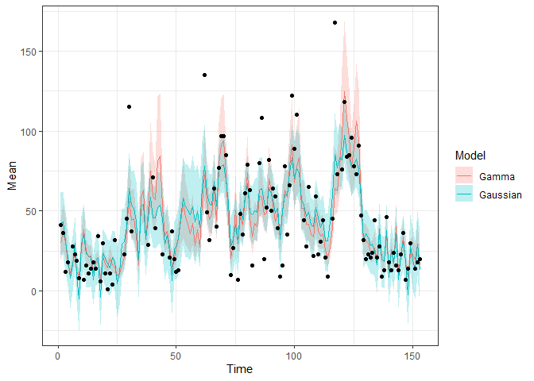

<!-- README.md is generated from README.Rmd. Please edit that file -->

# bssm

<!-- badges: start -->

[](https://www.repostatus.org/#active)
[](https://github.com/helske/bssm/actions)
[](https://codecov.io/gh/helske/bssm?branch=master)
[](http://cran.r-project.org/package=bssm)
[](http://cranlogs.r-pkg.org/badges/bssm)

<!-- badges: end -->

The `bssm` R package provides efficient methods for Bayesian inference
of state space models via particle Markov chain Monte Carlo and
importance sampling type weighted MCMC. Currently Gaussian, Poisson,
binomial, negative binomial, and Gamma observation densities with
linear-Gaussian state dynamics, as well as general non-linear Gaussian
models and discretely observed latent diffusion processes are supported.

For details, see

-   [The bssm paper on ArXiv](https://arxiv.org/abs/2101.08492) (to
    appear in R Journal),
-   [Package vignettes at
    CRAN](https://cran.r-project.org/web/packages/bssm/index.html)
-   Paper on [Importance sampling type estimators based on approximate
    marginal Markov chain Monte
    Carlo](https://onlinelibrary.wiley.com/doi/abs/10.1111/sjos.12492)

There are also couple posters and a talk related to IS-correction
methodology and bssm package:

-   [UseR!2021 talk
    slides](https://jounihelske.netlify.app/talk/user2021/)  
-   [SMC 2017 workshop: Accelerating MCMC with an
    approximation](http://users.jyu.fi/~jovetale/posters/SMC2017)
-   [UseR!2017: Bayesian non-Gaussian state space models in
    R](http://users.jyu.fi/~jovetale/posters/user2017.pdf)

The `bssm` package was originally developed with the support of Academy
of Finland grants 284513, 312605, and 311877. Current development is
focused on increased usability and stability.

## Installation

You can install the released version of bssm from
[CRAN](https://CRAN.R-project.org) with:

``` r
install.packages("bssm")
```

And the development version from [GitHub](https://github.com/) with:

``` r
# install.packages("devtools")
devtools::install_github("helske/bssm")
```

Or from R-universe with

``` r
install.packages("bssm", repos = "https://helske.r-universe.dev")
```

## Example

Consider the daily air quality measurements in New Your from May to
September 1973, available in the `datasets` package. Let’s try to
predict the missing ozone levels by simple linear-Gaussian local linear
trend model with temperature and wind as explanatory variables (missing
response variables are handled naturally in the state space modelling
framework, however no missing values in covariates are normally
allowed);

``` r
library("bssm")
#> 
#> Attaching package: 'bssm'
#> The following object is masked from 'package:base':
#> 
#>     gamma
library("dplyr")
#> 
#> Attaching package: 'dplyr'
#> The following objects are masked from 'package:stats':
#> 
#>     filter, lag
#> The following objects are masked from 'package:base':
#> 
#>     intersect, setdiff, setequal, union
library("ggplot2")
set.seed(1)

data("airquality", package = "datasets")

# Covariates as matrix. For complex cases, check out as_bssm function
xreg <- airquality %>% select(Wind, Temp) %>% as.matrix()

model <- bsm_lg(airquality$Ozone,
  xreg = xreg,  
  # Define priors, see ?bssm_prior
  # Initial value followed by parameters of the prior distribution
  beta = normal_prior(rep(0, ncol(xreg)), 0, 1),
  sd_y = gamma_prior(1, 2, 0.01),
  sd_level = gamma_prior(1, 2, 0.01), 
  sd_slope = gamma_prior(1, 2, 0.01))

fit <- run_mcmc(model, iter = 20000, burnin = 5000)
fit
#> 
#> Call:
#> run_mcmc.gaussian(model = model, iter = 20000, burnin = 5000)
#> 
#> Iterations = 5001:20000
#> Thinning interval = 1
#> Length of the final jump chain = 3593
#> 
#> Acceptance rate after the burn-in period:  0.239
#> 
#> Summary for theta:
#> 
#>                Mean        SD          SE
#> sd_y     20.8618647 1.9369381 0.068145131
#> sd_level  6.3731836 2.8013937 0.113153715
#> sd_slope  0.3388712 0.2833955 0.010355574
#> Wind     -2.5183269 0.5764833 0.020978488
#> Temp      1.0265846 0.2064343 0.007497538
#> 
#> Effective sample sizes for theta:
#> 
#>               ESS
#> sd_y     807.9079
#> sd_level 612.9297
#> sd_slope 748.9238
#> Wind     755.1359
#> Temp     758.1001
#> 
#> Summary for alpha_154:
#> 
#>              Mean        SD         SE
#> level -28.3163054 20.132341 0.69650977
#> slope  -0.3740463  1.685733 0.03683278
#> 
#> Effective sample sizes for alpha_154:
#> 
#>             ESS
#> level  835.4763
#> slope 2094.6363
#> 
#> Run time:
#>    user  system elapsed 
#>    0.89    0.02    0.91
obs <- data.frame(Time = 1:nrow(airquality),
  Ozone = airquality$Ozone) %>% filter(!is.na(Ozone))

pred <- fitted(fit, model)
pred %>%
  ggplot(aes(x = Time, y = Mean)) + 
  geom_ribbon(aes(ymin = `2.5%`, ymax = `97.5%`), 
    alpha = 0.5, fill = "steelblue") + 
  geom_line() + 
  geom_point(data = obs, 
    aes(x = Time, y = Ozone), colour = "Tomato") +
  theme_bw()
```


Same model but now assuming observations are from Gamma distribution:

``` r
model2 <- bsm_ng(airquality$Ozone,
  xreg = xreg,  
  beta = normal(rep(0, ncol(xreg)), 0, 1),
  distribution = "gamma",
  phi = gamma_prior(1, 2, 0.01),
  sd_level = gamma_prior(1, 2, 0.1), 
  sd_slope = gamma_prior(1, 2, 0.1))

fit2 <- run_mcmc(model2, iter = 20000, burnin = 5000, particles = 10)
fit2
#> 
#> Call:
#> run_mcmc.nongaussian(model = model2, iter = 20000, particles = 10, 
#>     burnin = 5000)
#> 
#> Iterations = 5001:20000
#> Thinning interval = 1
#> Length of the final jump chain = 3858
#> 
#> Acceptance rate after the burn-in period:  0.257
#> 
#> Summary for theta:
#> 
#>                  Mean          SD           SE        SE-IS
#> sd_level  0.057158663 0.035366227 0.0019652211 7.416778e-04
#> sd_slope  0.003894013 0.003654978 0.0001818441 7.567405e-05
#> phi       4.006977632 0.536273508 0.0157319790 1.071056e-02
#> Wind     -0.057351094 0.015411504 0.0004389087 3.051982e-04
#> Temp      0.052808820 0.008701489 0.0002478631 1.716846e-04
#> 
#> Effective sample sizes for theta:
#> 
#>                ESS
#> sd_level  323.8580
#> sd_slope  403.9906
#> phi      1161.9996
#> Wind     1232.9392
#> Temp     1232.4328
#> 
#> Summary for alpha_154:
#> 
#>               Mean         SD           SE        SE-IS
#> level -0.200656509 0.73134471 0.0205560413 0.0145184378
#> slope -0.002689176 0.02289051 0.0005131012 0.0005050788
#> 
#> Effective sample sizes for alpha_154:
#> 
#>            ESS
#> level 1265.801
#> slope 1990.238
#> 
#> Run time:
#>    user  system elapsed 
#>   10.59    0.02   10.62
```

Comparison:

``` r
pred2 <- fitted(fit2, model2)

bind_rows(list(Gaussian = pred, Gamma = pred2), .id = "Model") %>%
  ggplot(aes(x = Time, y = Mean)) + 
  geom_ribbon(aes(ymin = `2.5%`, ymax = `97.5%`, fill = Model), 
    alpha = 0.25) + 
  geom_line(aes(colour = Model)) + 
  geom_point(data = obs, 
    aes(x = Time, y = Ozone)) +
  theme_bw()
```



Now let’s assume that we also want to use the solar radiation variable
as predictor for ozone. As it contains few missing values, we cannot use
it directly. As the number of missing time points is very small, simple
imputation would likely be acceptable, but let’s consider more another
approach. For simplicity, the slope terms of the previous models are now
omitted, and we focus on the Gaussian case. Let *μ*<sub>*t*</sub> be the
true solar radiation at time *t*. Now for ozone *O*<sub>*t*</sub> we
assume following model:
$$
\\begin{aligned}
O\_t &= D\_t + \\alpha\_t + \\beta\_S \\mu\_t + \\sigma\_\\epsilon \\epsilon\_t,\\\\
\\alpha\_{t+1} &= \\alpha\_t + \\sigma\_\\eta\\eta\_t,\\\\
\\alpha\_1 &\\sim N(0, 100^2\\textrm{I}),
\\end{aligned}
$$
where *D*<sub>*t*</sub> = *β**X*<sub>*t*</sub> contains regression terms
related to wind and temperature, *α*<sub>*t*</sub> is the time varying
intercept term, and *β*<sub>*S*</sub> is the effect of solar radiation
*μ*<sub>*t*</sub>.

Now for the observed solar radiation *S*<sub>*t*</sub> we assume

$$
\\begin{aligned}
S\_t &= \\mu\_t\\\\
\\mu\_{t+1} &= \\mu\_t + \\sigma\_\\xi\\xi\_t,\\\\
\\mu\_1 &\\sim N(0, 100^2),
\\end{aligned}
$$
i.e. we assume as simple random walk for the *μ* which we observe
without error or not at all (there is no error term in the observation
equation *S*<sub>*t*</sub> = *μ*<sub>*t*</sub>).

We combine these two models as a bivariate Gaussian model with
`ssm_mlg`:

``` r
# predictors (not including solar radiation) for ozone
xreg <- airquality %>% select(Wind, Temp) %>% as.matrix()

# Function which outputs new model components given the parameter vector theta
update_fn <- function(theta) {
  D <- rbind(t(xreg %*% theta[1:2]), 1)
  Z <- matrix(c(1, 0, theta[3], 1), 2, 2)
  R <- diag(exp(theta[4:5]))
  H <- diag(c(exp(theta[6]), 0))
  # add third dimension so we have p x n x 1, p x m x 1, p x p x 1 arrays
  dim(Z)[3] <- dim(R)[3] <- dim(H)[3] <- 1
  list(D = D, Z = Z, R = R, H = H)
}

# Function for log-prior density
prior_fn <- function(theta) {
  sum(dnorm(theta[1:3], 0, 10, log = TRUE)) + 
    sum(dgamma(exp(theta[4:6]), 2, 0.01, log = TRUE)) + 
    sum(theta[4:6]) # log-jacobian
}

init_theta <- c(0, 0, 0, log(50), log(5), log(20))
comps <- update_fn(init_theta)

model <- ssm_mlg(y = cbind(Ozone = airquality$Ozone, Solar = airquality$Solar.R),
  Z = comps$Z, D = comps$D, H = comps$H, T = diag(2), R = comps$R, 
  a1 = rep(0, 2), P1 = diag(100, 2), init_theta = init_theta, 
  state_names = c("alpha", "mu"), update_fn = update_fn,
  prior_fn = prior_fn)

fit <- run_mcmc(model, iter = 60000, burnin = 10000)
fit
#> 
#> Call:
#> run_mcmc.gaussian(model = model, iter = 60000, burnin = 10000)
#> 
#> Iterations = 10001:60000
#> Thinning interval = 1
#> Length of the final jump chain = 12234
#> 
#> Acceptance rate after the burn-in period:  0.245
#> 
#> Summary for theta:
#> 
#>                Mean         SD           SE
#> theta_1 -3.89121114 0.58715113 0.0233827004
#> theta_2  0.98712126 0.18819758 0.0051506907
#> theta_3  0.06324657 0.02417334 0.0004672314
#> theta_4  0.82577262 0.67134723 0.0165661049
#> theta_5  4.75567622 0.05858454 0.0010887250
#> theta_6  3.05462451 0.07640392 0.0014803971
#> 
#> Effective sample sizes for theta:
#> 
#>               ESS
#> theta_1  630.5368
#> theta_2 1335.0487
#> theta_3 2676.7595
#> theta_4 1642.3041
#> theta_5 2895.5411
#> theta_6 2663.6361
#> 
#> Summary for alpha_154:
#> 
#>            Mean        SD        SE
#> alpha -16.44435  14.99708 0.3659912
#> mu    223.60490 116.49063 1.3409568
#> 
#> Effective sample sizes for alpha_154:
#> 
#>            ESS
#> alpha 1679.082
#> mu    7546.619
#> 
#> Run time:
#>    user  system elapsed 
#>   11.94    0.06   11.94
```

Draw predictions:

``` r
pred <- fitted(fit, model)

obs <- data.frame(Time = 1:nrow(airquality),
  Solar = airquality$Solar.R) %>% filter(!is.na(Solar))

pred %>% filter(Variable == "Solar") %>%
  ggplot(aes(x = Time, y = Mean)) + 
  geom_ribbon(aes(ymin = `2.5%`, ymax = `97.5%`), 
    alpha = 0.5, fill = "steelblue") + 
  geom_line() + 
  geom_point(data = obs, 
    aes(x = Time, y = Solar), colour = "Tomato") +
  theme_bw()
```


``` r
obs <- data.frame(Time = 1:nrow(airquality),
  Ozone = airquality$Ozone) %>% filter(!is.na(Ozone))

pred %>% filter(Variable == "Ozone") %>%
  ggplot(aes(x = Time, y = Mean)) + 
  geom_ribbon(aes(ymin = `2.5%`, ymax = `97.5%`), 
    alpha = 0.5, fill = "steelblue") + 
  geom_line() +  
  geom_point(data = obs, 
    aes(x = Time, y = Ozone), colour = "Tomato") +
  theme_bw()
```


## Recent changes (For all changes, see NEWS file.)

#### bssm 1.1.6 (Release date: 2021-09-06)

-   Cleaned codes and added more comprehensive tests in line with
    pkgcheck tests. This resulted in finding and fixing multiple bugs:
-   Fixed a bug in EKF-based particle filter which returned filtered
    estimates also in place of one-step ahead predictions.
-   Fixed a bug which caused an error in suggest\_N for nlg\_ssm.
-   Fixed a bug which caused incorrect sampling of smoothing
    distribution for ar1\_lg model when predicting past or when using
    simulation smoother.
-   Fixed a bug which caused an error when predicting past values in
    multivariate time series case.
-   Fixed sampling of negative binomial distribution in predict method,
    which used std::negative\_binomial which converts non-integer phi to
    integer. Sampling now uses Gamma-Poisson mixture for simulation.

#### bssm 1.1.4 (Release date: 2021-04-13)

-   Better documentation for SV model, and changed ordering of arguments
    to emphasise the recommended parameterization.
-   Fixed predict method for SV model.

#### bssm 1.1.3-2 (Release date: 2021-02-24)

-   Fixed missing parenthesis causing compilation fail in case of no
    OpenMP support.
-   Added pandoc version &gt;= 1.12.3 to system requirements.

#### bssm 1.1.3-1 (Release date: 2021-02-22)

-   Fixed PM-MCMC and DA-MCMC for SDE models and added an example to
    `ssm_sde`.
-   Added vignette for SDE models.
-   Updated citation information and streamlined the main vignette.

#### bssm 1.1.2 (Release date: 2021-02-08)

-   Some bug fixes, see NEWS for details.

#### bssm 1.1.0 (Release date: 2021-01-19)

-   Added function `suggest_N` which can be used to choose suitable
    number of particles for IS-MCMC.
-   Added function `post_correct` which can be used to update previous
    approximate MCMC with IS-weights.
-   Gamma priors are now supported in easy-to-use models such as
    `bsm_lg`.
-   The adaptation of the proposal distribution now continues also after
    the burn-in by default.
-   Changed default MCMC type to typically most efficient and robust
    IS2.
-   Renamed `nsim` argument to `particles` in most of the R functions
    (`nsim` also works with a warning).
-   Fixed a bug with bsm models with covariates, where all standard
    deviation parameters were fixed. This resulted error within MCMC
    algorithms.
-   Fixed a dimension drop bug in the predict method which caused error
    for univariate models.
-   Fixed few typos in vignette (thanks Kyle Hussman) and added more
    examples.

#### bssm 1.0.1-1 (Release date: 2020-11-12)

-   Added an argument `future` for predict method which allows
    predictions for current time points by supplying the original model
    (e.g., for posterior predictive checks). At the same time the
    argument name `future_model` was changed to `model`.
-   Fixed a bug in summary.mcmc\_run which resulted error when trying to
    obtain summary for states only.
-   Added a check for Kalman filter for a degenerate case where all
    observational level and state level variances are zero.
-   Renamed argument `n_threads` to `threads` for consistency with
    `iter` and `burnin` arguments.
-   Improved documentation, added examples.
-   Added a vignette regarding psi-APF for non-linear models.

#### bssm 1.0.0 (Release date: 2020-06-09)

Major update

-   Major changes for model definitions, now model updating and priors
    can be defined via R functions (non-linear and SDE models still rely
    on C++ snippets).
-   Added support for multivariate non-Gaussian models.
-   Added support for gamma distributions.
-   Added the function as.data.frame for mcmc output which converts the
    MCMC samples to data.frame format for easier post-processing.
-   Added truncated normal prior.
-   Many argument names and model building functions have been changed
    for clarity and consistency.
-   Major overhaul of C++ internals which can bring minor efficiency
    gains and smaller installation size.
-   Allow zero as initial value for positive-constrained parameters of
    bsm models.
-   Small changes to summary method which can now return also only
    summaries of the states.
-   Fixed a bug in initializing run\_mcmc for negative binomial model.
-   Fixed a bug in phi-APF for non-linear models.
-   Reimplemented predict method which now always produces data frame of
    samples.

#### bssm 0.1.11 (Release date: 2020-02-25)

-   Switched (back) to approximate posterior in RAM for PM-SPDK and
    PM-PSI, as it seems to work better with noisy likelihood estimates.
-   Print and summary methods for MCMC output are now coherent in their
    output.

#### bssm 0.1.10 (Release date: 2020-02-04)

-   Fixed missing weight update for IS-SPDK without OPENMP flag.
-   Removed unused usage argument … from expand\_sample.

#### bssm 0.1.9 (Release date: 2020-01-27)

-   Fixed state sampling for PM-MCMC with SPDK.
-   Added ts attribute for svm model.
-   Corrected asymptotic variance for summary methods.

For older versions, see NEWS file.
